## A fish out of water

A multidisciplinary, applied sport scientist

. . .

My usual audiences are...sport science students and other people working in
sport!

. . .

<br /> <br />

From the ANZIAM website:

> Our role is to...Provide for the exchange of ideas and information between
> applied mathematicians and [users of mathematics in science, engineering and
> industry]{.yellow}

. . .

<br /> <br />

My goal is to shed light on [how mathematics and statistics is used in
sport]{.cyan} today, and perhaps entice you to work in this space in future!

## The spark

::::::::: columns
::::::: {.column width="60%"}
Athens 2004 Olympic & Paralympic Games

<br />

:::::: inline-fragment
::: fragment
Novel, biomimetic textile developed for swimsuits
:::

<br />

::: fragment
Fiona Fairhurst - Inspired by shark denticles
:::

<br />

::: fragment
@oeffner2012: <br /> Reduced drag, greater thrust with Speedo FSII
:::
::::::
:::::::

::: {.column width="40%"}
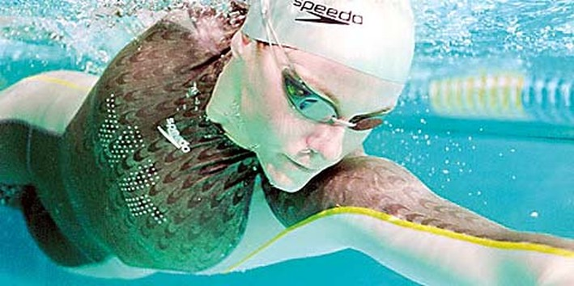{.absolute top="10%" right="0" height="30%"}
{.absolute top="50%" right="0"
height="40%"}
:::
:::::::::

## 

::::::::: {.timeline .vertical .tl-label-banner .fragment-slide}
::: {.event data-label="2009 - Deakin University" style="--tl-color-accent: #23054C;"}
**Honours - Sports Biomechanics**<br /><br /> Working with [wearable
sensors]{.yellow} developed for sport and [3-D motion capture]{.yellow}
:::

::: {.event .fragment data-label="2010 - Deakin University" style="--tl-color-accent: #420D6D;"}
**PhD - Applied Sports Physiology** <br /> <br /> Started learning about [mixed
models]{.yellow} and [how to code in R]{.yellow}
:::

::: {.event .fragment data-label="2015 - Geelong Cats FC & Deakin University" style="--tl-color-accent: #5D1679;"}
**Research Fellow** <br /> <br /> Analytical support across sport science,
opposition analysis, recruiting <br /> <br /> Research projects using [network
analysis]{.yellow} and [decision tree models]{.yellow}
:::

::: {.event .fragment data-label="2018 - High Performance Sport NZ" style="--tl-color-accent: #590D4B;"}
**Senior Insights Researcher (initially)**<br /> **Head of Intelligence
(later)** <br /> <br /> My first foray into longitudinal qualitative research
<br /> <br /> Developed [data engineering]{.yellow} knowledge, applied [text
mining]{.yellow} techniques
:::

::: {.event .fragment data-label="2023 - Callaghan Innovation" style="--tl-color-accent: #A22A60;"}
**Strategic Insights Analyst** <br /> <br /> Individual contributor role, using
[quant and qual methods]{.yellow} for reporting and internal research / analysis
projects<br /> <br /> A new context, beyond sport
:::

::: {.event .fragment data-label="2026 - La Trobe University" style="--tl-color-accent: #F42A34;"}
**Lecturer in Sports Analytics & Performance Analysis** <br /> <br /> Sharing
what I've learned through teaching <br /> <br /> Pursuing research to learn and
apply [Bayesian modelling]{.yellow}, [network analysis]{.yellow}, and
[clustering techniques]{.yellow}
:::
:::::::::

##  {background-color="#0e172b" background-image="images/christine-lENhFCC2tGY-unsplash.jpg" background-opacity="0.7"}

[**A young field growing rapidly**]{.mimic-title .absolute right="18.5%"
top="15%"}

## Technology changes

::::::::: columns
::::::: {.column width="60%"}
Increased use of video

<br />

:::::: inline-fragment
::: fragment
Wearable and portable technologies

<br />
:::

::: fragment
Moving beyond count statistics to detailed event records (play-by-play)

<br />
:::

::: fragment
Multi-camera optical tracking systems <br />(e.g., Hawk-Eye)
:::
::::::
:::::::

::: {.column .fragment width="40%"}
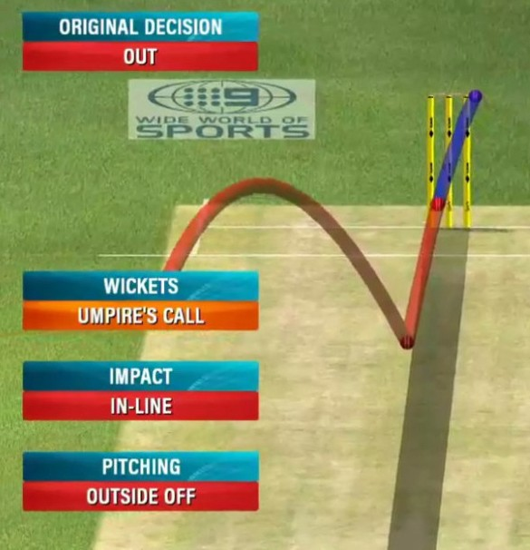{.absolute top="10%" right="0" height="60%"}
:::
:::::::::

## Data and analysis practices

::::::::: columns
::::::: {.column width="60%"}
Programmatic approaches to working with data

<br />

:::::: inline-fragment
::: fragment
Accessibility of statistical software

<br />
:::

::: fragment
Advancements in computer vision capabilities

<br />
:::

::: fragment
Improved data storage practices enabling data to be integrated from multiple
sources
:::
::::::
:::::::

::: {.column width="40%"}
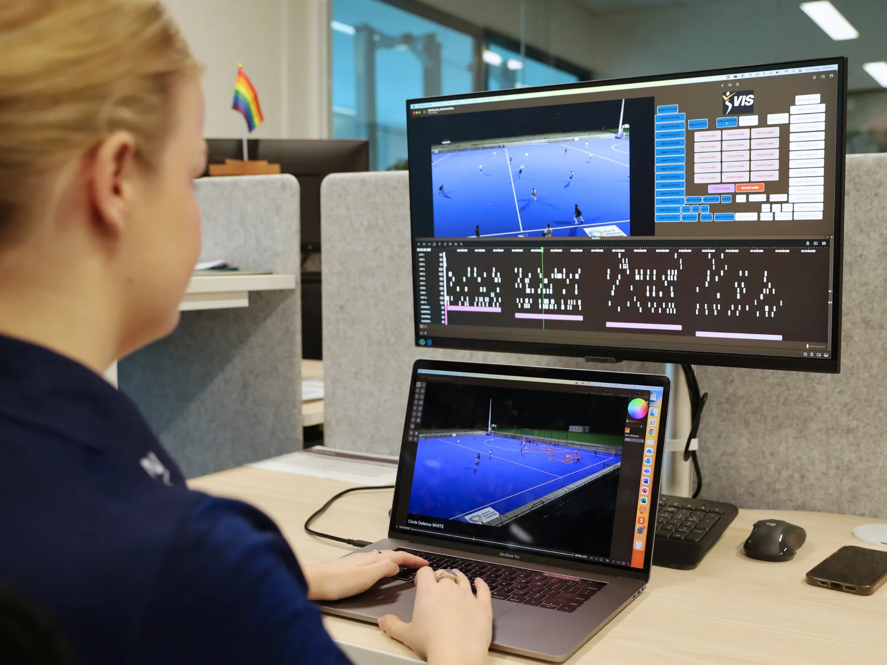{.absolute top="10%" right="0" height="45%"}
:::
:::::::::

## Education and industry changes

::::::::: columns
::::::: {.column width="60%"}
Substantial growth in private sports data and technology providers

<br />

:::::: inline-fragment
::: fragment
More data supplied by governing bodies and broadcast partners

<br />
:::

::: fragment
Competitor practices

<br />
:::

::: fragment
Dedicated tertiary courses for sports analytics
:::
::::::
:::::::

::: {.column width="40%"}
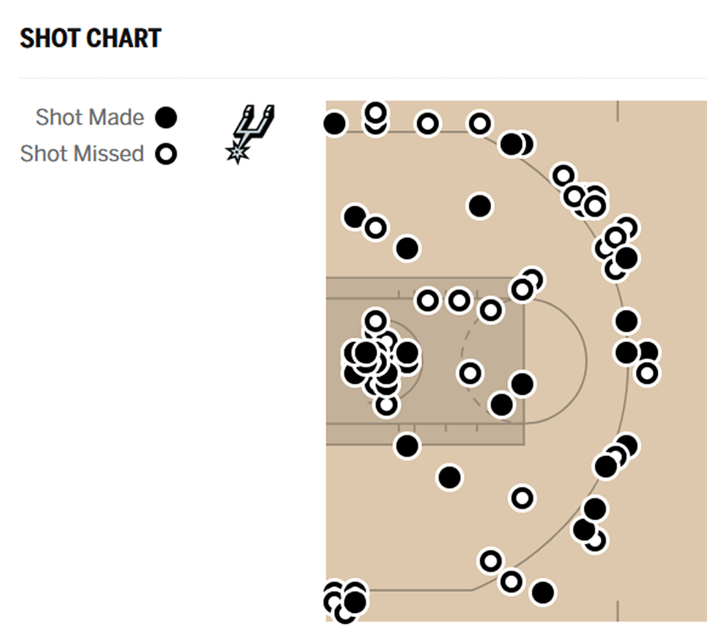{.absolute top="10%" right="0" height="55%"}
:::
:::::::::

## "Awkward adolescence"

{.absolute top="10%" left="35%" height="30%"}

. . .

<br /> <br /> <br /> <br /> <br /> <br /> <br />

Growth in sports analytics has been rapid but [uneven]{.cyan}

<br />

. . .

Sometimes growing in ways we're not ready for - ["running before we can
walk"]{.cyan}

<br />

. . .

[Role clarity]{.cyan} and integration within a performance team

<br />

. . .

Even still, there is a lot that is exciting about [change and
maturation]{.yellow}!

##  {background-color="#0e172b" background-image="images/pawel-czerwinski-eybM9n4yrpE-unsplash.jpg" background-opacity="0.7"}

[**Signal processing**]{.mimic-title .absolute right="0" top="0"}

## Processing signals from wearable / portable devices

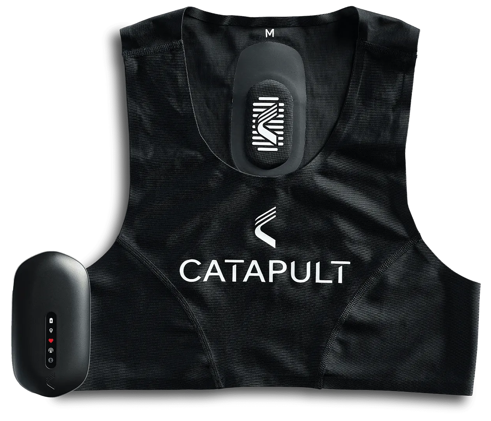{.absolute left="15%" height="45%"}

::::: inline-fragment
::: fragment
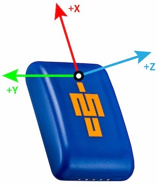{.absolute right="15%" height="45%"}
:::

::: fragment
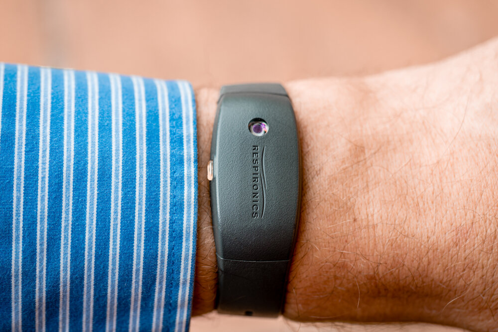{.absolute left="30%" top="60%" height="40%"}
:::
:::::

## Example: Identifying sleep stages from actigraphy

@acker2021:

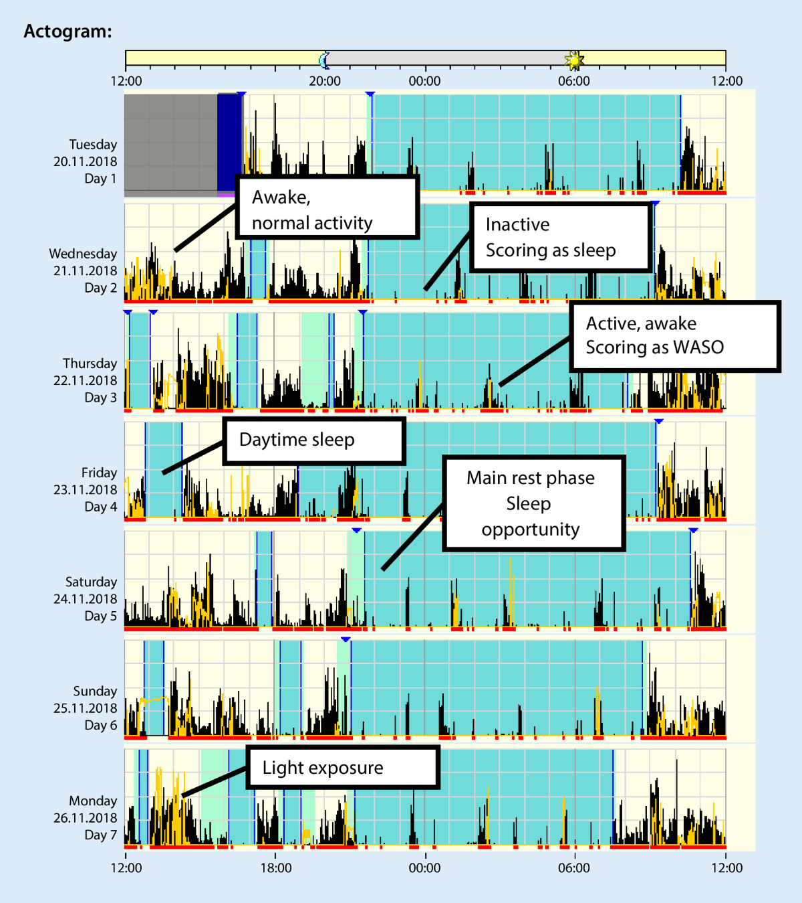{.absolute left="25%" height="80%"}

##  {background-color="#0e172b" background-image="images/ski-jumping.png" background-opacity="0.7"}

[**Fluid dynamics**]{.mimic-title .absolute left="17%" top="25%"
style="rotate: 10deg;"}

## Example: Individualised suits for track cyclists

:::::::: columns
:::::: {.column width="60%"}
@hpsnz2025:

Collaboration between

- Cycling NZ
- High Performance Sport NZ's Goldmine Innovation team
- One Studio

<br />

::::: inline-fragment
::: fragment
Individualised approach to textile development, considering rider shape and
position on bike
:::

<br />

::: fragment
Tunnel and track testing - [Reduced aerodynamic drag]{.cyan} compared to
previous suits
:::
:::::
::::::

::: {.column width="40%"}
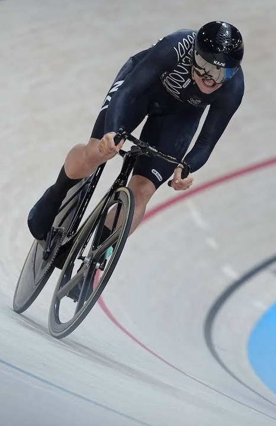{.absolute top="10%" right="0" height="80%"}
:::
::::::::

## Example: Sit ski design

:::::::: columns
:::::: {.column width="60%"}
@hpsnz2018:

Collaboration between

- Snow Sports NZ
- High Performance Sport NZ's Goldmine Innovation team
- Dynamic Composites

<br />

::::: inline-fragment
::: fragment
Re-designed sit ski [reduced drag by 1.5%]{.cyan}
:::

<br />

::: fragment
PyeongChang 2018, Downhill Sitting: <br /> Corey Peters won bronze in 1:26.01
<br /> Only [0.22 seconds ahead]{.cyan} of 4th! (0.26% diff.)
:::
:::::
::::::

::: {.column width="40%"}
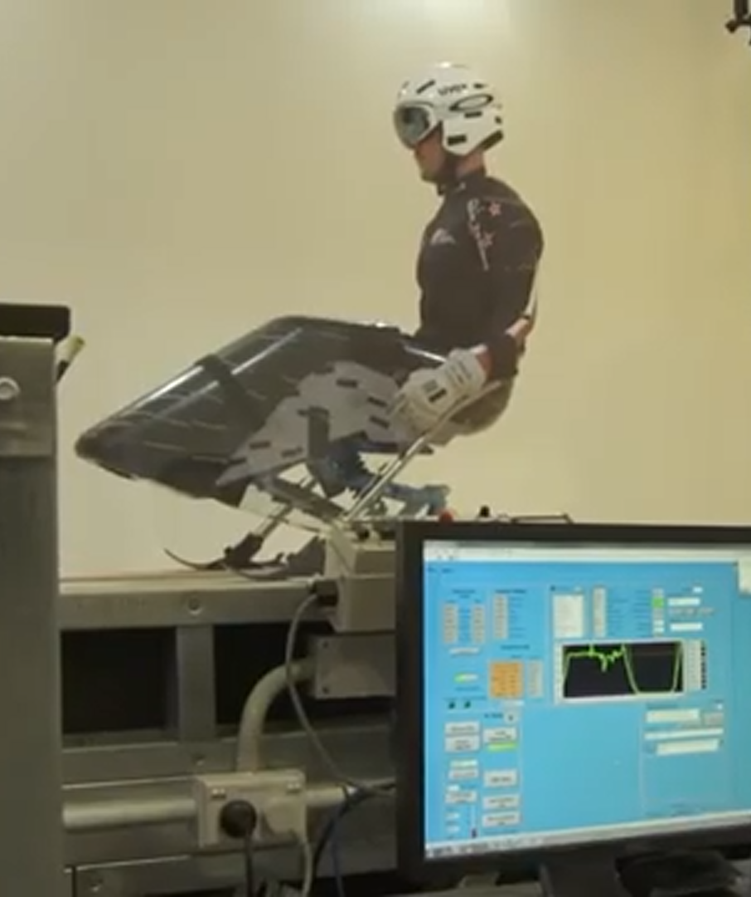{.absolute top="10%" right="0" height="70%"}
:::
::::::::

##  {background-color="#0e172b" background-image="images/north.jpg" background-opacity="0.7"}

[**Patterns of play**]{.mimic-title .absolute left="0" top="30%"
style="rotate: -30deg;"}

## Counts of game actions

Snippet of AFL game statistics, via @afltables2010:

```{r afl_count_stats, echo = FALSE}

afl_count_stats <- tibble::tribble(
  ~team, ~player, ~pct_of_game, ~kicks, ~marks, ~handballs, ~goals, ~behinds,
  
  "Geelong", "Gary Ablett", 0.92, 13, 5, 24, 2, 2,
  "Geelong", "Jimmy Bartel", 0.91, 10, 6, 19, 2, 0,
  "Geelong", "Tom Hawkins", 0.87, 8, 7, 6, 2, 1,
  
  "Essendon", "Alwyn Davey", 0.65, 6, 0, 4, 2, 1,
  "Essendon", "Angus Monfries", 0.89, 10, 5, 6, 2, 1,
  "Essendon", "David Zaharakis", 0.75, 10, 5, 9, 2, 2) |>
  as.data.frame() |>
  dplyr::select(
    team, player, pct_of_game, kicks, handballs, dplyr::everything())

afl_count_stats |>
  gt::gt() |>
  gt::tab_header(
    title = gt::md("**Round 1, 2010 - Geelong vs. Essendon**")) |>
  gt::cols_label(
    team        = "Team",
    player      = "Player name",
    pct_of_game = "% of game played",
    kicks       = "Kicks",
    handballs   = "Handballs",
    marks       = "Marks",
    goals       = "Goals",
    behinds     = "Behinds") |>
  gt::tab_style(
    style = gt::cell_text(weight = "bold"),
    locations = list(
      gt::cells_column_labels(columns = dplyr::everything()))) |>
  gt::tab_style(
    style = gt::cell_fill(color = "#d3f3f1", alpha = 0.7),
    locations = gt::cells_body(
      rows = stringr::str_detect(team, "Geelong"))) |>
  gt::tab_style(
    style = gt::cell_fill(color = "#e9b7ce", alpha = 0.7),
    locations = gt::cells_body(
      rows = stringr::str_detect(team, "Essendon")))

```

. . .

[Issues]{.yellow}

No contextual information

. . .

Detail lost in summing up values

. . .

Difficult to evaluate quality of actions

## Possession chains / play-by-play

Snippet of AFL possession chain data:

```{r afl_chain_data, echo = FALSE, cache = TRUE}

# Read data in
chains_snippet <- readxl::read_excel(
  path = "data/chains_snippet.xlsx",
  col_names = TRUE) |>
  janitor::clean_names()

# Clean data for later plotting
chains_snippet_tidy <- chains_snippet |>
  dplyr::mutate(
    counting_var = 1) |>
  dplyr::group_by(chain) |>
  dplyr::mutate(
    possession_num = cumsum(counting_var)) |>
  dplyr::ungroup() |>
  # Identify chains with overlapping start / end possessions for plotting purposes
  dplyr::mutate(
    chain_A = dplyr::case_when(
      chain == 7 | (chain == 8 & possession_num == 1) ~ TRUE,
      TRUE                                            ~ FALSE),
    chain_B = dplyr::case_when(
      chain == 8 | (chain == 9 & possession_num == 1) ~ TRUE,
      TRUE                                            ~ FALSE),
    chain_C = dplyr::case_when(
      chain == 9 ~ TRUE,
      TRUE       ~ FALSE)) |>
  dplyr::select(-counting_var) |>
  dplyr::mutate(
    team = factor(team)) |>
  dplyr::mutate(
    label_chain_a = dplyr::case_when(
      chain_A == TRUE & chain == 7 ~ paste0(player, ", ", disposal),
      chain_A == TRUE & chain == 8 ~ paste0(chain_start_type, " to ", team),
      TRUE                         ~ NA_character_),
    label_chain_b = dplyr::case_when(
      chain_B == TRUE & chain == 8 ~ paste0(player, ", ", disposal),
      chain_B == TRUE & chain == 9 ~ paste0(chain_start_type, " to ", team),
      TRUE                         ~ NA_character_),
    label_chain_c = dplyr::case_when(
      chain_C == TRUE & chain == 9 & possession_num != 4 ~ paste0(player, ", ", disposal),
      chain_C == TRUE & chain == 9 & possession_num == 4 ~ paste0(player, ", ", stringr::str_to_lower(chain_end_type)),
      TRUE                         ~ NA_character_))

# Display data in a table
chains_snippet |>
  dplyr::select(
    -c("round", "match")) |>
  gt::gt() |>
  gt::tab_header(
    title = gt::md("**Round 1, 2015 - Carlton vs. Richmond**")) |>
  gt::tab_style(
    style = gt::cell_text(weight = "bold"),
    locations = list(
      gt::cells_column_labels(columns = dplyr::everything()))) |>
  gt::tab_style(
    style = gt::cell_fill(color = "#fed766", alpha = 0.5),
    locations = gt::cells_body(
      rows = stringr::str_detect(team, "RICH"))) |>
  gt::tab_style(
    style = gt::cell_fill(color = "#69a2b0", alpha = 0.5),
    locations = gt::cells_body(
      rows = stringr::str_detect(team, "CARL")))

```

. . .

[Enhancements:]{.cyan}

More info about when and where actions took place

. . .

Connections between actions and outcomes

. . .

Enables analysis of actions in sequence

## Visualising possession chains

```{r plot_afl_oval, echo=FALSE, message=FALSE, warning=FALSE, cache=TRUE}

# Using code from: https://github.com/alittlefitness/afl_visual_analysis/blob/master/AFL%20Analysis%20app.R

# Section required to calculate the intersection of the 50m arc with the boundary of the oval
size <- tibble::tibble(x = 160, y = 140)
z <- (((size$x + size$y) / 4.01)^2 - 2500 + (size$x / 2)^2) / (2 * (size$x / 2))
h <- ((size$x + size$y) / 4)
a <- sqrt(h^2 - z^2)
angle <- acos(a / 50)
    
# Oval plot
oval <- ggplot2::ggplot(size) +
  # outer boundary
  ggforce::geom_ellipse(
    ggplot2::aes(
      x0 = 0, y0 = 0, a = x / 2, b = y / 2, angle = 0),
    size = 1.2, fill = "darkgreen", alpha = 0.2) +
  # centre square
  ggplot2::geom_tile(
    ggplot2::aes(
      x = 0, y = 0, width = 50, height = 50),
    fill = "#ffffff00", col = "black", size = 1.2) +
  # right goalsquare
  ggplot2::geom_tile(
    ggplot2::aes(
      (x = x / 2) - 4.5, y = 0, width = 9, height = 6.7),
    fill = "#ffffff00", col = "black", size = 1.2) +
  # left goalsquare
  ggplot2::geom_tile(
    ggplot2::aes(
      (x = -x / 2) + 4.5, y = 0, width = 9, height = 6.7),
    fill = "#ffffff00", col = "black", size = 1.2) +
  # centre circle
  ggforce::geom_circle(
    ggplot2::aes(
      x0 = 0, y0 = 0, r = 3),
    size = 1.2) +
  # right 50m arc
  ggforce::geom_arc(
    ggplot2::aes(
      x0 = x / 2, y0 = 0, r = 50, start = -angle, end = -(3.142 - angle)),
    size = 1.2) +
  # left 50m arc
  ggforce::geom_arc(
    ggplot2::aes(
      x0 = -x / 2, y0 = 0, r = 50, start = angle, end = 3.142 - angle),
    size = 1.2)

```

```{r plot_chain_A, echo = FALSE, cache = TRUE, fig.height = 8}

# Chain A (chain 7-8)
oval +
  ggplot2::geom_point(
    data = chains_snippet_tidy |>
      dplyr::filter(chain_A == TRUE),
    ggplot2::aes(
      x = disp_x_start,
      y = disp_y_start,
      fill = team,
      colour = team),
    size = 9, shape = 21, stroke = 2) +
  ggplot2::geom_segment(
    data = chains_snippet_tidy |>
      dplyr::filter(chain_A == TRUE & chain != 8),
    ggplot2::aes(
      x = disp_x_start,
      y = disp_y_start,
      xend = disp_x_end,
      yend = disp_y_end),
    linewidth = 1, lineend = "round", linejoin = "mitre",
    arrow = ggplot2::arrow(length = grid::unit(0.015, "npc"))) +
  ggrepel::geom_label_repel(
    data = chains_snippet_tidy |>
      dplyr::filter(chain_A == TRUE & team == "RICH"),
    ggplot2::aes(
      x = disp_x_start,
      y = disp_y_start,
      label = label_chain_a),
    size = 6, seed = 359, segment.colour = NA, nudge_x = 20) +
  ggrepel::geom_label_repel(
    data = chains_snippet_tidy |>
      dplyr::filter(chain_A == TRUE & team == "CARL"),
    ggplot2::aes(
      x = disp_x_start,
      y = disp_y_start,
      label = label_chain_a),
    size = 6, seed = 359, segment.colour = NA, nudge_x = -22) +
  ggplot2::scale_fill_manual(
    values = c(
      "RICH" = "#ffbf00",
      "CARL" = "#FFFFFF")) +
  ggplot2::scale_colour_manual(
    values = c(
      "RICH" = "#000000",
      "CARL" = "#003049")) +
  ggplot2::theme_void() +
  ggplot2::theme(
    legend.position = "top",
    legend.title = ggplot2::element_blank(),
    legend.text = ggplot2::element_text(size = ggplot2::rel(2)))

```

## Visualising possession chains

```{r plot_chain_B, echo = FALSE, cache = TRUE, fig.height = 8}

# Chain B (chains 8-9)
oval +
  ggplot2::geom_point(
    data = chains_snippet_tidy |>
      dplyr::filter(chain_B == TRUE),
    ggplot2::aes(
      x = disp_x_start,
      y = disp_y_start,
      fill = team,
      colour = team),
    size = 9, shape = 21, stroke = 2) +
  ggplot2::geom_segment(
    data = chains_snippet_tidy |>
      dplyr::filter(chain_B == TRUE & chain != 9),
    ggplot2::aes(
      x = disp_x_start,
      y = disp_y_start,
      xend = disp_x_end,
      yend = disp_y_end),
    linewidth = 1, lineend = "round", linejoin = "mitre",
    arrow = ggplot2::arrow(length = grid::unit(0.015, "npc"))) +
  ggrepel::geom_label_repel(
    data = chains_snippet_tidy |>
      dplyr::filter(chain_B == TRUE),
    ggplot2::aes(
      x = disp_x_start,
      y = disp_y_start,
      label = label_chain_b),
    size = 6, seed = 359, segment.colour = NA, nudge_x = 22) +
  ggplot2::scale_fill_manual(
    values = c(
      "RICH" = "#ffbf00",
      "CARL" = "#FFFFFF")) +
  ggplot2::scale_colour_manual(
    values = c(
      "RICH" = "#000000",
      "CARL" = "#003049")) +
  ggplot2::theme_void() +
  ggplot2::theme(
    legend.position = "top",
    legend.title = ggplot2::element_blank(),
    legend.text = ggplot2::element_text(size = ggplot2::rel(2)))

```

## Visualising possession chains

```{r plot_chain_C, echo = FALSE, cache = TRUE, fig.height = 8}

# Chain C (chain 9)
oval +
  ggplot2::geom_point(
    data = chains_snippet_tidy |>
      dplyr::filter(chain_C == TRUE),
    ggplot2::aes(
      x = disp_x_start,
      y = disp_y_start,
      fill = team,
      colour = team),
    size = 9, shape = 21, stroke = 2, show.legend = TRUE) +
  ggplot2::geom_segment(
    data = chains_snippet_tidy |>
      dplyr::filter(chain_C == TRUE),
    ggplot2::aes(
      x = disp_x_start,
      y = disp_y_start,
      xend = disp_x_end,
      yend = disp_y_end),
    linewidth = 1, lineend = "round", linejoin = "mitre",
    arrow = ggplot2::arrow(length = grid::unit(0.015, "npc"))) +
  ggrepel::geom_label_repel(
    data = chains_snippet_tidy |>
      dplyr::filter(chain_C == TRUE & possession_num == 1),
    ggplot2::aes(
      x = disp_x_start,
      y = disp_y_start,
      label = label_chain_c),
    size = 6, seed = 359, segment.colour = NA, nudge_y = -10) +
  ggrepel::geom_label_repel(
    data = chains_snippet_tidy |>
      dplyr::filter(chain_C == TRUE & possession_num != 1),
    ggplot2::aes(
      x = disp_x_start,
      y = disp_y_start,
      label = label_chain_c),
    size = 6, seed = 359, segment.colour = NA, nudge_y = 10) +
  ggplot2::scale_fill_manual(
    values = c(
      "RICH" = "#ffbf00",
      "CARL" = "#FFFFFF"),
    drop = FALSE) +
  ggplot2::scale_colour_manual(
    values = c(
      "RICH" = "#000000",
      "CARL" = "#003049"),
    drop = FALSE) +
  ggplot2::theme_void() +
  ggplot2::theme(
    legend.position = "top",
    legend.title = ggplot2::element_blank(),
    legend.text = ggplot2::element_text(size = ggplot2::rel(2)))

```

## Network analysis in Australian football {.smaller}

@taylor2020: https://doi.org/10.1080/02640414.2020.1740490

Aims: Construct networks using possession chain data, and examine how their
network characteristics relate to game outcomes

Data: \~150,000 possession events from all matches played in the 2015 AFL season
(206 games, regular season and finals)

Network analysis: Edge list --\> Weighted edge --\> Adjacency matrix --\>
Determine network metrics (degree centrality, density, cluster coefficient,
entropy)

Results: The most direct ball movement patterns (i.e., low network density
values) were observed for the most desirable outcomes. More successful kick-in
chains exhibited less predictable ball movement patterns as indicated by high
entropy values.

Key take-away: Using sequential possession data enables quantification of how
players on the same team interact with one another - going beyond qualitative
judgments of whether a team seems predictable, direct, heavily reliant on a few
key players, etc.

## Spatiotemporal analysis

@krampe2026 - Using positional tracking data to analyse team formations

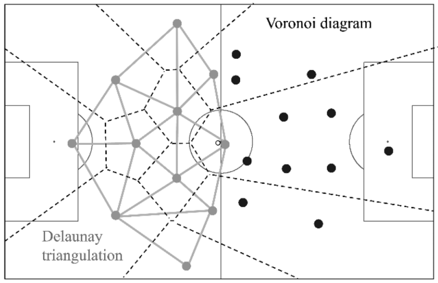{.absolute left="15%" height="70%"}

##  {background-color="#0e172b" background-image="images/norbert-braun-rbUmyKlVyZU-unsplash.jpg" background-opacity="0.7"}

[**Deriving features from visual information**]{.mimic-title .absolute
left="49%" top="15%"}

## Important origins: Live notational analysis

::::: columns
::: {.column width="50%"}
Example from @rostgaard2008:

Notational analysis by hand of 1 player, prior to and in contact with the ball
during a soccer match.
:::

::: {.column width="50%"}
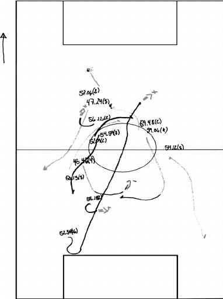{.absolute right="5%"
height="85%"}
:::
:::::

## Software-based notational analysis

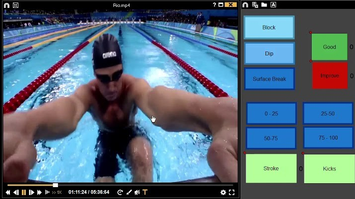{.absolute left="10%" height="70%"}

## Automated video annotation

Example: The Deep Detector for Actions and Swimmer Heads system (DeepDASH)
proposed by @hall2020

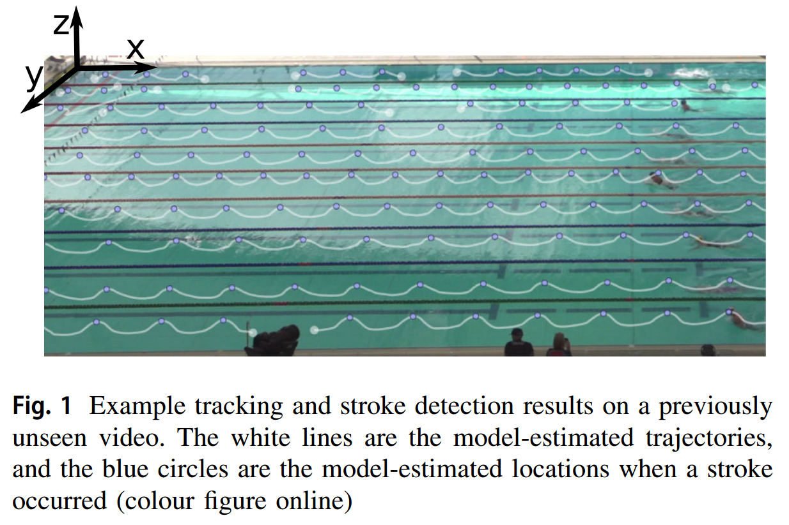{.absolute left="15%" height="70%"}

##  {background-color="#0e172b" background-image="images/nfl_game.jpeg" background-opacity="0.7"}

[**An industry example**]{.mimic-title .absolute left="50%" top="75%"}

## National Football League (NFL)

::::::: columns
::::: {.column width="50%"}
[Prof Michael Lopez]{.cyan}

Now: Senior Director of Football Data & Analytics, NFL <br /> <br />

<hr />

<br />

:::: inline-fragment
::: fragment
Previously:

- Bachelor in Mathematics \| Bates College
- Masters in Statistics \| University of Massachusetts, Amherst
- PhD in Biostatistics \| Brown University
:::
::::
:::::

::: {.column width="50%"}
{.absolute right="5%" height="75%"}
:::
:::::::

## National Football League (NFL)

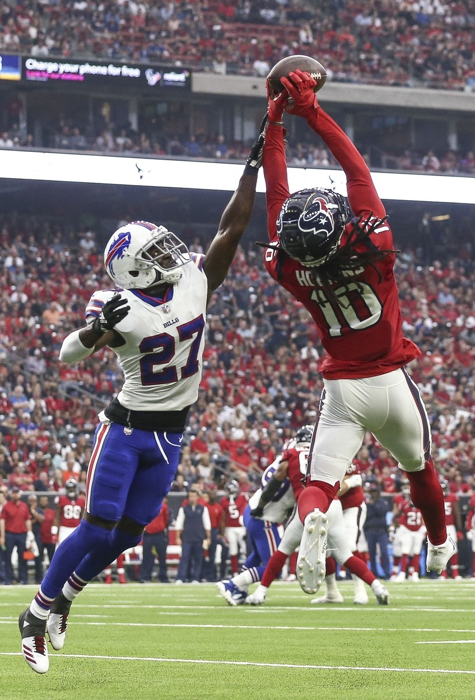{.absolute right="5%" height="80%"}

@lopez2026:

> ["Our job is to make the game better."]{.yellow}

:::: inline-fragment
::: fragment
Competitiveness of the game

Officiating

Health and safety

Pace of play

Use of modern tech to improve the game
:::
::::

## Example: Late-game strategy in the NFL

@nflops2021:

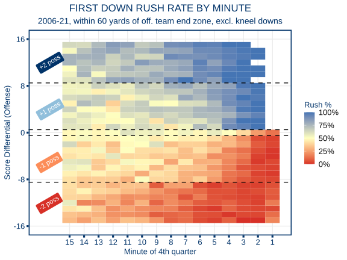{.absolute left="15%" height="80%"}

## 

{.absolute left="25%" height="80%"}

##  {background-color="#0e172b" background-image="images/mark-fletcher-brown-HVrhFfk2ZSQ-unsplash.jpg" background-opacity="0.7"}

[**What might the future hold?**]{.mimic-title .absolute right="10%" top="30%"}

## Opportunities {background-color="#0e172b" background-image="images/kai-gradert-0QWUm-wYXGA-unsplash.jpg" background-opacity="0.2"}

Many rich sources of data across scientific disciplines, although...

. . .

Better mathematical and statistical knowledge needed to analyse data in robust
and efficient ways - ["We don't know what we don't know"]{.yellow}

. . .

<br />

Volume of available data has grown rapidly. But [what really matters?]{.yellow}

. . .

<br />

Opportunities for leaders to [use information and analysis more
effectively]{.yellow}

##  {background-color="#0e172b" background-image="images/joshua-kantarges-N_7Kb4hpaoU-unsplash.jpg" background-opacity="0.15"}

::: {.absolute left="5%" top="25%" style="font-size:1.5em; padding: 0.5em 1em; background-color: rgba(0, 0, 0, 0.8);"}
**Dr Jacquie Tran** <br /> <br /> :globe_with_meridians: www.jacquietran.com
<br /> :email: jacquie.tran\@latrobe.edu.au <br/> :computer:
https://jacquietran.github.io/2026_anziam_vic
:::

## References
